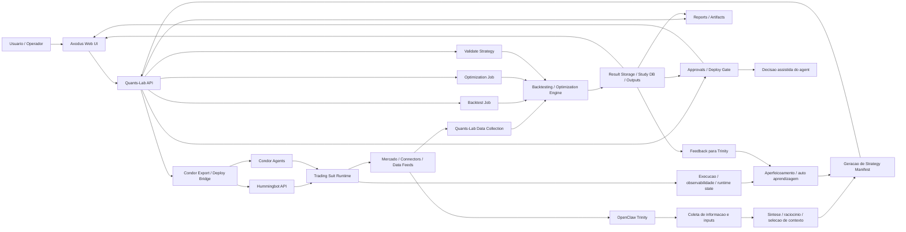

# Axodus Trading Suite - Mapa Operacional e Status Atual

Este documento consolida o estado atual da Axodus Trading Suite, com foco em como `OpenClaw Trinity`, `Quants-Lab`, `Axodus Web UI`, `Hummingbot API` e `Condor` se conectam hoje.

O objetivo aqui e simples:

1. colocar toda a suite no mesmo mapa;
2. deixar claro o que ja esta operacional;
3. mostrar o fluxo real de trabalho do agent e da interface humana;
4. servir como documento-base para as proximas integracoes.

## Mapa Geral



## Leitura Rapida

- `OpenClaw Trinity` e o agent de orquestracao e inteligencia.
- `Quants-Lab` e o motor de validacao, backtest, otimizacao, relatorios e aprovacao.
- `Axodus Web UI` sera a interface humana e comercial da suite.
- `Hummingbot API` e `Condor` sao a ponte para runtime e deploy.
- `Mercado / Data Feeds` alimenta tanto a coleta de dados quanto o loop de aprendizado.

## Papel de Cada Framework

### 1. OpenClaw Trinity

**Papel**
- colher contexto, sinais, premissas e inputs do usuario;
- transformar a intencao em manifesto estruturado de estrategia;
- iniciar processos de validacao, backtest e otimizacao no Quants-Lab;
- interpretar resultados;
- alimentar o loop de aperfeicoamento.

**Fluxo esperado**
- coleta de informacao e inputs;
- cria estrategias e testa no Labs;
- faz backtest / optimization das estrategias selecionadas;
- decide quais candidatas merecem follow-up;
- encaminha deploy para a suite quando houver aprovacao;
- observa resultados e retroalimenta o proprio processo.

**Status atual**
- `parcialmente pronto`
- o contrato API necessario para Trinity ja esta pronto no Quants-Lab;
- exemplos canonicos de manifesto e payloads ja existem;
- o client Trinity propriamente dito ainda precisa ser implementado no repo do OpenClaw ou no layer de integracao.

**Artefatos prontos para Trinity**
- [docs/trinity-integration.md](/opt/quants-lab/docs/trinity-integration.md)
- [examples/trinity/strategy_manifest_macd_bb.json](/opt/quants-lab/examples/trinity/strategy_manifest_macd_bb.json)
- [examples/trinity/backtest_request_macd_bb.json](/opt/quants-lab/examples/trinity/backtest_request_macd_bb.json)
- [examples/trinity/optimization_request_macd_bb.json](/opt/quants-lab/examples/trinity/optimization_request_macd_bb.json)

### 2. Quants-Lab

**Papel**
- receber manifestos de estrategia;
- validar controllers, ranges e regras;
- rodar backtests e otimizações;
- exportar resultados, relatorios e equity curves;
- criar approval requests;
- servir de backend headless para Trinity e Axodus.

**Capacidades atuais**
- API headless em FastAPI;
- CLI operacional;
- backtesting;
- optimization com Optuna;
- relatorios HTML e humanos;
- walk-forward validation;
- approval gate;
- export para Condor / Hummingbot bridge;
- data collection task-based.

**Status atual**
- `operacional`

**Pontos de acesso**
- `python cli.py serve --api-only --port 8075`
- `/docs`
- `/api/v1/strategies/validate`
- `/api/v1/backtests`
- `/api/v1/optimizations`
- `/api/v1/jobs/{job_id}`
- `/api/v1/reports/{study_name}`
- `/api/v1/approvals`

### 3. Axodus Web UI

**Papel**
- interface humana da suite;
- builder/edição de estratégias;
- disparo de backtests e optimizations;
- leitura de relatorios;
- fila de aprovacoes;
- monitoracao do runtime.

**Status atual**
- `planejado / proxima camada`
- o Quants-Lab ja esta preparado para servir como backend;
- a UI dedicada ainda nao foi implementada neste repo;
- a recomendacao arquitetural continua sendo: `Axodus consome Quants-Lab via API`, sem acoplamento direto ao filesystem ou banco.

### 4. Hummingbot API

**Papel**
- expor controle do runtime/bots;
- receber comandos de deploy;
- fornecer snapshots de runtime, portfolio e bots.

**Status atual**
- `integrado no Quants-Lab`
- comportamento real depende da instancia externa estar configurada e acessivel.

### 5. Condor

**Papel**
- receber/exportar agentes;
- servir como camada de empacotamento e deploy da estrategia aprovada;
- integrar o resultado otimizado com o trading suit.

**Status atual**
- `integrado no Quants-Lab`
- dry-run e export funcionam;
- deploy live depende de ambiente externo e aprovacao.

## Status Consolidado

| Componente | Papel | Status |
|---|---|---|
| OpenClaw Trinity | Orquestracao, raciocinio, criacao de manifestos, loop de melhoria | Parcialmente pronto |
| Quants-Lab API | Backend headless da suite | Operacional |
| Quants-Lab CLI | Operacao humana e tecnica | Operacional |
| Backtesting Engine | Execucao de backtests | Operacional |
| Optimization Engine | Busca de parametros com Optuna | Operacional |
| Reports / Artifacts | Relatorios humanos, JSON, equity curve | Operacional |
| Approval Gate | Bloqueio/pendencia para deploy | Operacional |
| Hummingbot Bridge | Runtime bridge | Operacional, dependente de ambiente |
| Condor Export / Deploy | Export e deploy bridge | Operacional, dependente de ambiente |
| Axodus Web UI | Interface humana/comercial | Planejado |
| Self-learning loop | Feedback estruturado para o agent | Parcial / conceitual |

## Fluxo Atual do Agent

### A. Coleta de informacao e inputs

`OpenClaw Trinity`:
- coleta objetivos do usuario;
- coleta contexto de mercado;
- coleta restricoes operacionais;
- coleta preferencia de connector, par, timeframe e risco.

### B. Criacao de estrategia

Trinity converte isso para um `StrategyManifest` com:
- controller;
- controller_type;
- universo de dados;
- ranges de parametros;
- filtros de risco;
- politica de validacao;
- parametros fixos.

### C. Validacao no Labs

Trinity envia para:
- `POST /api/v1/strategies/validate`

Se o manifesto for valido:
- pode seguir para `backtest`;
- ou direto para `optimization`.

### D. Backtest das estrategias selecionadas

Para uma candidata especifica:
- `POST /api/v1/backtests`

Uso ideal:
- quando Trinity ja tem um candidato concreto;
- quando quer testar uma hipotese especifica antes da busca completa.

### E. Otimizacao das estrategias mais promissoras

Para busca de parametros:
- `POST /api/v1/optimizations`

Saidas:
- `result.json`
- `best_config.yml`
- `trials.parquet`
- `report.html`
- `human_report.md`
- `human_report.json`
- `equity_curve.csv`
- `equity_curve.png`
- `approval_instructions.txt`

### F. Deploy para a Trading Suit

Se a validacao passar:
- approval request pode sair `pending`
- entao um humano ou policy layer pode aprovar
- o Quants-Lab exporta para Condor e usa a ponte Hummingbot para deploy

Se falhar:
- approval request sai `blocked`
- o deploy live fica barrado

### G. Coleta de dados

O Quants-Lab continua responsavel por:
- candles;
- caches de backtesting;
- artefatos de estudo;
- snapshots necessarios para analise e reproducao.

### H. Feedback e aperfeicoamento / auto aprendizagem

O loop desejado e:
- Trinity roda validacao/backtest/optimization;
- le relatorios e approvals;
- observa runtime e comportamento pos-deploy;
- atualiza heuristicas;
- gera nova versao de manifesto.

**Status atual do loop**
- `parcial`
- os artefatos e sinais para esse loop ja existem;
- o mecanismo autonomo de aprendizado continuo ainda precisa ser implementado no lado do OpenClaw.

## Status Real do Processo Hoje

### Ja funciona

- Quants-Lab como motor headless;
- contratos de API para Trinity;
- examples de manifest/backtest/optimization;
- optimize + report + approval flow;
- equity curve e relatorios humanos;
- deploy gate por validacao.

### Ja esta provado em execucao

- rodada limpa de optimization em `BTC-USDT` e `ETH-USDT`;
- geracao de artifacts por study;
- approval requests persistidos;
- status `blocked` coerente com validacao ruim da estrategia atual.

### Ainda depende de implementacao externa

- client real do Trinity usando esses endpoints;
- Axodus Web UI consumindo essa API;
- loop de feedback automatico do OpenClaw;
- camada comercial / multiusuario / autenticacao do site Axodus.

## Como Operar Hoje

### Modo agent / integracao

```bash
python cli.py serve --api-only --port 8075
```

Depois:
- Trinity usa `/api/v1/*`
- Axodus UI futura usa o mesmo contrato

### Modo humano

```bash
python cli.py optimize --config config/optimize_macd_bb.yml
python cli.py report --study <study_name>
python cli.py approvals list
```

## Proxima Camada Recomendada

1. Implementar o client Trinity:
   - submit
   - poll
   - fetch report
   - read approval state

2. Implementar a Axodus Web UI:
   - strategy builder
   - studies
   - reports
   - approvals
   - runtime

3. Fechar o loop de aprendizado do OpenClaw:
   - consumir resultados historicos
   - ajustar ranges e filtros
   - aprender com aprovacoes/rejeicoes e runtime pos-deploy

## Resumo Executivo

Hoje a suite esta assim:

- `OpenClaw Trinity`: pronto para integrar, mas ainda precisa do client/orquestrador final;
- `Quants-Lab`: pronto e operacional como motor central;
- `Axodus UI`: ainda nao implementada, mas a base de backend esta pronta;
- `Hummingbot/Condor`: integrados como ponte de runtime e deploy;
- `Self-learning`: com dados e artefatos disponiveis, mas sem automacao completa ainda.

Em outras palavras: o backend da suite esta de pe. O trabalho agora muda de "consertar motor" para "orquestrar agent e interface humana em cima dele".
